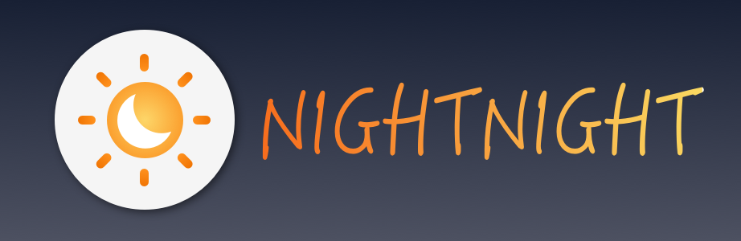
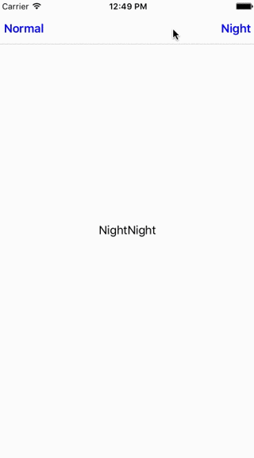

<p align="center">
  
</p>

<p align="center">
  <a href="https://travis-ci.org/Draveness/NightNight"></a>
  <a href="https://img.shields.io/cocoapods/v/NightNight.svg"></a>
  <a href="https://github.com/Carthage/Carthage"></a>
  <a href="https://img.shields.io/cocoapods/p/NightNight.svg?style=flat"></a>
</p>

**NightNight** makes it easy to integrate night mode. It provides multiple APIs which all contain keyword **mixed**.

> If you want to implement night mode in Objective-C project without import swift code.
> This is the Objective-C version [DKNightVersion](https://github.com/Draveness/DKNightVersion)

```swift
let view = UIView()
view.mixedBackgroundColor = MixedColor(normal: 0xffffff, night: 0x000000)

let imageView = UIImageView()
imageView.mixedImage = MixedImage(normal: UIImage(named: "normal"), night: UIImage(named: "night")) 
```

<p align="center">
    <a href="#features">Features</a> • <a href="#usage">Usage</a> • <a href="#customize">Customize</a> • <a href="#demo">Demo</a> • <a href="#installation">Installation</a> • <a href="#license">License</a>
</p>

## Features

- [x] Integrate night mode easily
- [x] UIColor and UIImage support
- [x] Support NSAttributedString
- [x] Better autocompletion
- [x] Customize with notification

## Usage

+ Use `MixedColor` instead of `UIColor`

    ```swift
    let view = UIView()
    
    view.mixedBackgroundColor = MixedColor(normal: 0xffffff, night: 0x000000)
    ```

+ Use `MixedImage` instead of `UIImage`

    ```swift
    let imageView = UIImageView()
    
    imageView.mixedImage = MixedImage(normal: normal, night: night)
    ```

+ Support `NSAttributedString`

    ```swift
    let attributedString = NSMutableAttributedString(string: "NightNight")
    attributedString.setMixedAttributes(
        [NNForegroundColorAttributeName: MixedColor(normal: 0x000000, night: 0xfafafa)],
        range: NSRange(location: 0, length: 9)
    )
    
    public let NNForegroundColorAttributeName
    public let NNBackgroundColorAttributeName
    public let NNUnderlineColorAttributeName
    ```

+ `NavigationBar` barStyle

    ```swift
    let navigationBar = navigationController?.navigationBar

    navigationBar.mixedBarStyle = MixedBarStyle(normal: .Default, night: .Black)
    ```

+ Change current theme to `.NORMAL` or `.NIGHT`

    ```swift
    NightNight.theme = .NORMAL
    NightNight.theme = .NIGHT
    ```

## Customize

NightNight will send `NightNightThemeChangeNotification`. if you wanna some customize features, you can observe it and change what you want in corresponding selector.

```swift
public let NightNightThemeChangeNotification
```

## Demo

<p align="center">
    
</p>

## Installation

### Carthage

[Carthage](https://github.com/Carthage/Carthage) is a decentralized dependency manager that automates the process of adding frameworks to your Cocoa application.

You can install Carthage with [Homebrew](http://brew.sh/) using the following command:

```bash
$ brew update
$ brew install carthage
```

To integrate NightNight into your Xcode project using Carthage, specify it in your `Cartfile`:

```ogdl
github "draveness/NightNight"
```

### Cocoapods

[CocoaPods](http://cocoapods.org) is a dependency manager for Cocoa projects.

You can install it with the following command:

```bash
$ gem install cocoapods
```

To integrate NightNight into your Xcode project using CocoaPods, specify it in your `Podfile`:

```ruby
use_frameworks!

pod 'NightNight'
```

### Manually
1. Download and drop ```NightNight/Classes```folder in your project.  
2. Congratulations!  

## License

Copyright (c) 2016 Draveness (http://github.com/draveness)

NightNight is available under the MIT license. See the LICENSE file for more info.

Permission is hereby granted, free of charge, to any person obtaining a copy
of this software and associated documentation files (the "Software"), to deal
in the Software without restriction, including without limitation the rights
to use, copy, modify, merge, publish, distribute, sublicense, and/or sell
copies of the Software, and to permit persons to whom the Software is
furnished to do so, subject to the following conditions:

The above copyright notice and this permission notice shall be included in all
copies or substantial portions of the Software.

THE SOFTWARE IS PROVIDED "AS IS", WITHOUT WARRANTY OF ANY KIND, EXPRESS OR
IMPLIED, INCLUDING BUT NOT LIMITED TO THE WARRANTIES OF MERCHANTABILITY,
FITNESS FOR A PARTICULAR PURPOSE AND NONINFRINGEMENT. IN NO EVENT SHALL THE
AUTHORS OR COPYRIGHT HOLDERS BE LIABLE FOR ANY CLAIM, DAMAGES OR OTHER
LIABILITY, WHETHER IN AN ACTION OF CONTRACT, TORT OR OTHERWISE, ARISING FROM,
OUT OF OR IN CONNECTION WITH THE SOFTWARE OR THE USE OR OTHER DEALINGS IN THE
SOFTWARE.

